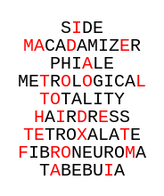

# A simple tool to hide text in other text
The hidden text appears as red letters within a larger block of meaningless black text.

Running the script with no arguments will hide the word "Example", otherwise it will hide the first argument.

The second argument sets the output path. The generated image is named `scramble.png` and created in the current directory if not output is provided.

## Example Usage:
`python scrambler.py "hidden message" example.png`

## Web App
The message scrambler can also be run as a web app. There are only two endpoints:

- `/` input text to scramble
- `/scramble` view the output, text and color information are sent as url queries

You can see a live version here: https://scrambler.absentbird.com/
